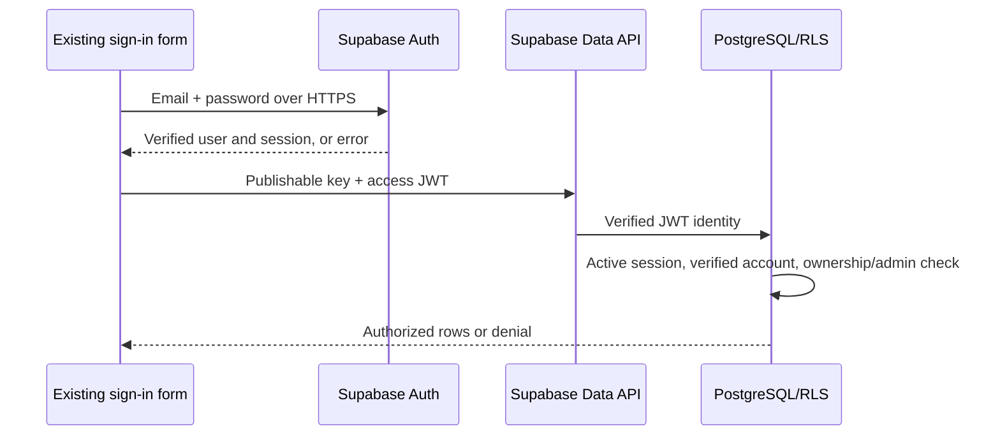

# Authentication and authorization

## Components and request flow

The existing sign-in/sign-up forms and admin modal keep their layout and styles. [authService.ts](../src/services/authService.ts) calls Supabase Auth and rejects failed, missing, anonymous or unconfirmed sessions. Signup without a session asks the user to confirm their email; it does not create a local authenticated identity. Names and phone numbers in user metadata are display information, never permission claims.

[AuthContext.tsx](../src/contexts/AuthContext.tsx) restores each session with a server `getUser()` check. SDK events and browser focus revalidate access. Authentication errors clear the visible identity. Identity changes clear private caches and remount views; async fetches use a generation check to avoid restoring another user's cached results. Logout clears local data and revokes the current Supabase session.

For admin login, [authService.ts](../src/services/authService.ts) also calls `is_admin()`. [The migration](../supabase/migrations/20260915165812_secure_auth.sql) checks membership in `private.admin_users` by Auth UUID. Browser flags, an email match, and editable metadata cannot grant this role. Database authorization also checks verification, ban/deletion status and the JWT's `session_id` against `auth.sessions`, so server-revoked sessions lose access without waiting for their JWT to expire.

## Credentials and tokens

[supabaseClient.js](../src/supabaseClient.js) exposes only the project URL and publishable key. Passwords are sent to Supabase over HTTPS; application code does not persist or log them. The Supabase SDK owns access-token/refresh-token handling and automatic refresh. Customer sessions use browser localStorage under `pxc_customer_session_v2`; separate admin sessions use tab sessionStorage under `pxc_admin_session_v2`. These are browser-readable tokens, not HttpOnly cookies: an XSS flaw could still steal them. Vercel response headers restrict script sources and browser capabilities, but do not replace RLS.

Google OAuth uses the SDK's PKCE flow and origin-based `/signin` callback. There are no wildcard success-message listeners. The Google provider must be configured in the Supabase project before its existing button can work.

## Booking and review permissions

[supabaseService.ts](../src/services/supabaseService.ts) uses Supabase exclusively. The legacy-named [firestoreService.ts](../src/services/firestoreService.ts) is a compatibility adapter. Backend errors are never treated as successful local writes.

| Caller | Allowed access |
| --- | --- |
| Guest | Submit validated pending booking; read/cancel that booking with its expiring random capability |
| Verified customer | Read own trusted bookings; cancel own eligible bookings; submit rate-limited reviews |
| Verified admin | Read all bookings; update status/details and delete bookings |

Guests get a 256-bit random capability stored only in sessionStorage. The database stores its SHA-256 hash in a private table with a seven-day expiry. It is not put in URLs. Losing browser storage loses that guest access. A verified account can claim new guest bookings matching its server-verified email; this does not prove the original submission was made by that customer. Review verification derives from a trusted completed booking, never a posted `verified` field. Public reviews exclude the owner's UUID.

Direct anonymous booking SELECT/UPDATE/INSERT and authenticated INSERT are revoked. Public RPC functions intentionally run with definer privileges to validate guest capabilities or account ownership before accessing private records. Their execute grants, fixed empty search paths and field allowlists are explicit. Advisor notices for these intentional RPCs and private tables with no public policies should be reviewed, not silenced by granting broader permissions.

## Deployment and administrator setup

1. Apply the reviewed SQL migration as the database owner, then deploy the matching frontend. Never restore the old unrestricted policies to accommodate an old frontend.
2. In Supabase Auth, keep email confirmation enabled; set a server-side password minimum of 12 characters. Enable leaked-password protection where available, configure delivery/SMTP and exact production `/signin` redirect URLs. Browser password validation alone is insufficient. See [Supabase password security](https://supabase.com/docs/guides/auth/password-security) and [redirect URLs](https://supabase.com/docs/guides/auth/redirect-urls).
3. The owner creates and confirms `primexpress33@gmail.com` with a new password entered privately. Grant the role only after verifying that exact account, using [admin_access.sql](../supabase/admin_access.sql). No public signup can create an admin role.
4. Verify anonymous REST booking access is denied and an authenticated admin can access its portal. Review [Vercel headers](https://vercel.com/docs/project-configuration/vercel-json#headers), including the inline JSON-LD script hash, when changing domains or HTML.

On 16 September 2026, the live project was verified with email confirmation enabled, a 12-character password minimum, secure email changes and secure password changes enabled, and anonymous sign-ins disabled. Leaked-password protection remains unavailable on its current plan; the dashboard requires Pro or above. Google OAuth is not configured.

Vercel install and build commands explicitly select Bun 1.4.2. Its older bundled Bun could not parse the version-2 lockfile, even though the repository declares its package manager version. Keep the explicit version synchronized with `package.json` and the security workflow.

The original database permitted unauthenticated ownership/approval edits. On first application, the migration records every existing booking ID in `private.legacy_booking_quarantine`. Original data remains visible to admins but cannot establish customer ownership or verified-review eligibility. Reapplying the migration does not quarantine new bookings. An owner must reconcile each historical row against trusted business records before correcting ownership/approval fields and removing that ID from quarantine. The migration does not assert that the historical records were actually tampered with.

## Operational limits

- Admin MFA is not required by this implementation. Enroll factors and add a server-side `aal2` requirement plus a compatible challenge flow before requiring step-up authentication.
- Guest throttling is five submissions per email per hour, not a global/IP anti-bot system. Production abuse protection should include an edge/WAF or CAPTCHA strategy.
- The original Firestore rules allow broad access. The repository now contains deny-all rules, but applying Supabase SQL does not deploy Firestore rules. Check and lock the old Firebase project separately if it was used.
- The old exposed admin password must be considered compromised wherever it was reused. Removing it from current code cannot erase copies or Git history.
- Booking mail helpers prepare drafts; they are not an authenticated backend email-delivery service. Recipient addresses are validated as one mailbox and URL-encoded so customer input cannot inject extra recipients or mail headers.

Local regression tests cover failed login, email confirmation, private grants, customer isolation, active-session revocation, guest tokens, historical-row quarantine, review verification, spreadsheet formula injection and mailto recipient/header injection. A passing scan is not proof that all possible vulnerabilities have been found.
